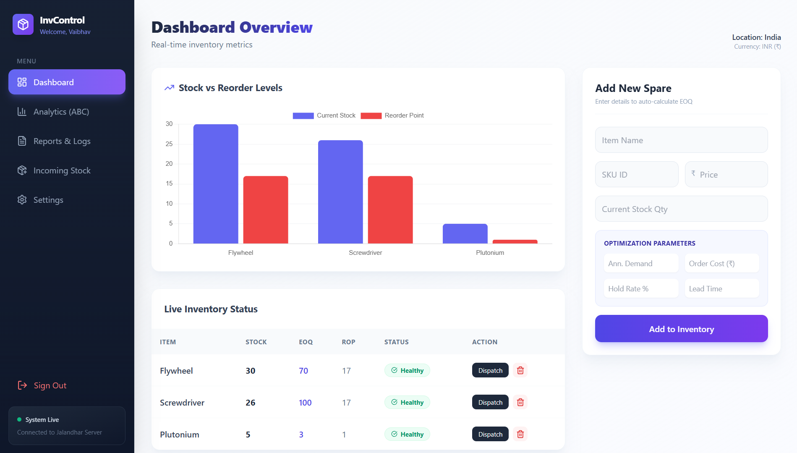
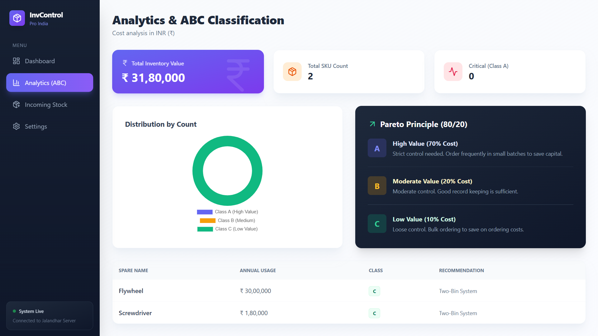
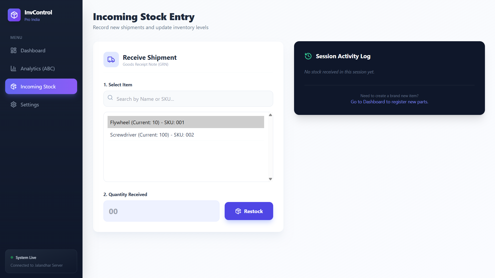
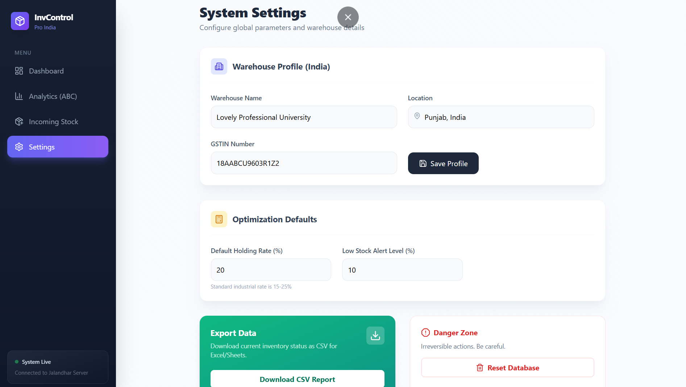
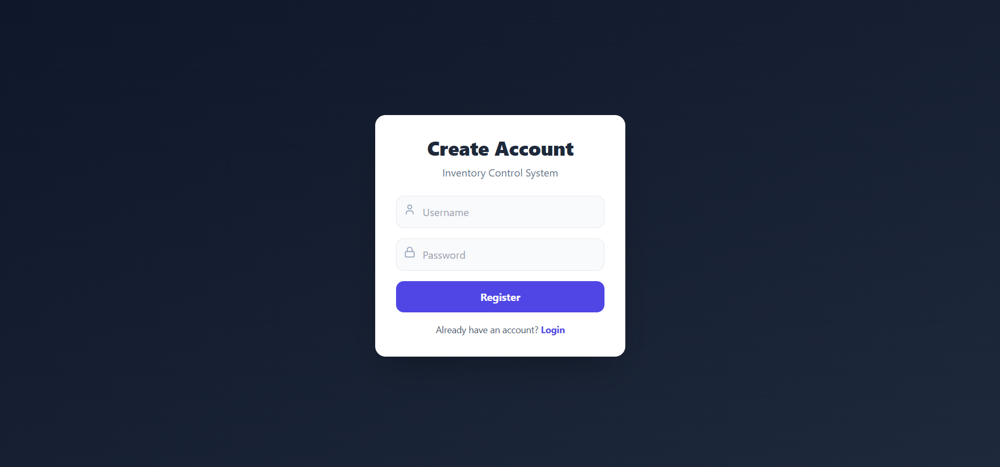

# 📦 Optimum Inventory Control System by Vaibhav Pratap Deo

**A full-stack inventory management system designed for industrial machine spares.**

This application uses the **MERN Stack** (MongoDB, Express, React, Node.js) to automate inventory decisions using mathematical models like **Economic Order Quantity (EOQ)** and **ABC Analysis**. It helps warehouses minimize holding costs, prevent stockouts, and classify items based on the Pareto Principle (80/20 Rule).

---

## 🚀 Key Features

### 1. 📊 Smart Dashboard
- **Real-time Monitoring:** Visualizes Current Stock vs. Reorder Points (ROP) using dynamic charts.
- **Auto-Status Tags:** Automatically flags items as **"Healthy"** (Green) or **"Reorder Now"** (Red) based on lead time and safety stock.

### 2. 🧮 Intelligent Math Models (Backend)
- **Economic Order Quantity (EOQ):** Calculates the ideal order size to minimize holding and ordering costs.
- **Reorder Point (ROP):** Predicts exactly when to restock based on daily usage and lead time.

### 3. 🏭 Inventory Operations
- **Dispatch (Consumption):** One-click dispatch button to record usage of spares.
- **Incoming Stock (GRN):** Dedicated module to receive new shipments and update stock levels instantly.
- **Safety Deletion:** Secure deletion of obsolete items with browser confirmation prompts.

### 4. 📈 Advanced Analytics (ABC Analysis)
- **Pareto Principle (80/20 Rule):** Automatically categorizes inventory into:
  - **Class A (Critical):** High-value items (70% of total cost).
  - **Class B (Moderate):** Mid-range items (20% of total cost).
  - **Class C (Low Value):** Consumables (10% of total cost).

### 5. ⚙️ Administrative Tools
- **Export to CSV:** One-click download of inventory data for Excel/Google Sheets reporting.
- **Warehouse Profile:** Customizable settings for Location (India) and GSTIN.

---

## 🛠️ Tech Stack

| Component | Technology Used |
| :--- | :--- |
| **Frontend** | React.js (Vite), Tailwind CSS, Chart.js, Lucide React |
| **Backend** | Node.js, Express.js |
| **Database** | MongoDB (Compass & Atlas) |
| **State Management** | React Hooks (useState, useEffect) |

---

## 📸 Project Screenshots

| **Dashboard (Live Monitoring)** | **Analytics (ABC Classification)** |
|:---:|:---:|
|  |  |

| **Incoming Stock Entry** | **Settings & Export** |
|:---:|:---:|
|  |  |

| **Secure Login / Registration** |
|:---:|
|  |

---

## ⚙️ Installation & Run Guide

Follow these steps to run the project locally.

### 1. Clone the Repository
```bash```
git clone [https://github.com/vaibhavdeo21/Optimum-Inventory-Control-MERN.git](https://github.com/vaibhavdeo21/Optimum-Inventory-Control-MERN.git)
cd Optimum-Inventory-Control-MERN

### 2. Backend Setup
Navigate to the backend folder, install dependencies, and start the server.

```bash```
cd backend
npm install
node server.js
Output: Server running on port 5000 & MongoDB Connected

### 3. Frontend Setup
Open a new terminal, navigate to the project root, and start the React app.
```Bash```
# (Make sure you are in the root folder, not inside backend)
npm install
npm run dev
Open your browser at http://localhost:5173


### 4. 🧮Algorithms Implemented
1. Economic Order Quantity (EOQ)
Used to determine the optimal order quantity that minimizes total inventory costs.
$$EOQ = \sqrt{\frac{2 \times D \times S}{H}}$$
•	D: Annual Demand
•	S: Ordering Cost per order
•	H: Holding Cost per unit per year
2. Reorder Point (ROP)
Determines the level of stock at which a new order should be placed.
$$ROP = (\text{Average Daily Usage} \times \text{Lead Time}) + \text{Safety Stock}$$
3. ABC Classification Logic
Items are sorted by Annual Usage Value (Unit Price × Annual Demand).
•	Class A: Top 70% of cumulative value (Requires strict control).
•	Class B: Next 20% of cumulative value (Requires moderate control).
•	Class C: Bottom 10% of cumulative value (Requires loose control).

📝 License
This project is created for academic purposes.